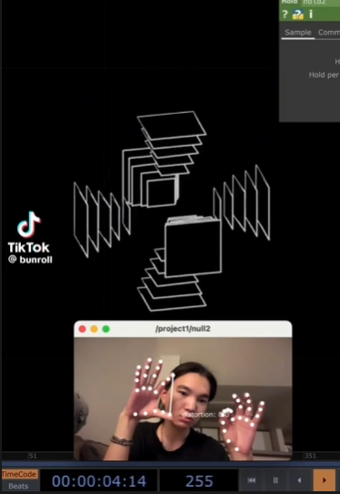

# funcv

[](inspiration.mp4)

## Overview

This project is an interactive 3D visualization tool that uses real-time hand tracking via a webcam. By leveraging MediaPipe and OpenCV, it detects hand landmarks and allows users to control a dynamic 3D structure (concentric rings of squares and spinning circles) with their hand gestures. The project demonstrates computer vision, 3D geometry, and real-time interaction.

## Features

- **Hand Tracking:** Uses MediaPipe to detect and track hand landmarks from a webcam feed.
- **Gesture Control:** Adjusts the rotation speed, size, and movement of a 3D structure based on hand gestures.
- **3D Visualization:** Renders concentric rings of squares and spinning circles in a simulated 3D space, projected onto 2D.
- **Real-Time Feedback:** Visualizes both the webcam feed (with hand landmark overlays) and the 3D structure in real time.

## Requirements

- Python 3.8+
- OpenCV (`opencv-python`)
- MediaPipe
- NumPy

You can install the dependencies with:

```bash
pip install opencv-python mediapipe numpy
```

## Usage

1. **Connect a webcam** to your computer.
2. **Run the main script:**

   ```bash
   python main.py
   ```

3. Two windows will appear:
   - The webcam feed with hand tracking overlays.
   - The 3D rotating structure, which you can control with your hand gestures.

   - **Left hand:** Controls the rotation speed.
   - **Right hand:** Controls the size and movement of the structure.

4. **Exit** by pressing the `Esc` key.

## File Structure

- `main.py` — Main application logic, visualization, and gesture handling.
- `hand_control.py` — Hand tracking and gesture interpretation using MediaPipe.
- `geometry_utils.py` — 3D geometry utilities for creating and transforming shapes.
- `inspiration.mp4` — (Optional) Reference or demo video.
- `readme.md` — Project documentation.

## Acknowledgments
- [Tiktok link](https://www.tiktok.com/@bunroll/video/7487125255144656148) Inspiration
- [MediaPipe](https://google.github.io/mediapipe/) for hand tracking.
- [OpenCV](https://opencv.org/) for image processing and visualization.
